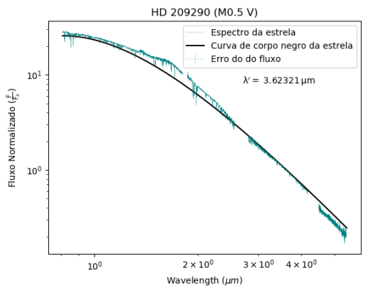
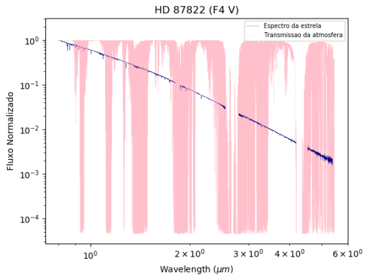
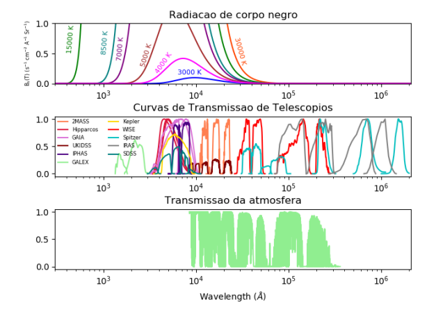

# Data visualization
## Stellar spectra, construction of blackbody curves of stars of different types and transmission curve of the atmosphere and of several astronomical surveys.

This work was carried out in 2017.

In this work, I create 3 types of graphs:

1) In the first type of graph, I plotted the spectrum (with error bars) of 4 stars, each of a different spectral type (F, G, K and M). Furthermore, I constructed and plotted, superimposed on the spectrum, a blackbody curve for each of these stars, based on their effective temperatures. An example of the result can be seen in the Figure below, which shows the spectrum of the star HD 209290, on a logarithmic scale, normalized to a wavelength without absorptions or emissions and its blackbody curve for its effective temperature (3580 K). Similarly was done with each of the four stars.

2) The second series of graphs consists of the spectrum of those same stars superimposed, now, on the transmission curve of our atmosphere. In the example below, you can see the spectrum of the star HD 87822, on a logarithmic scale, with flux normalized to its maximum value and the transmission curve of the Earth's atmosphere in the range 0.85 - 7.2 µm. Again, the same way was done for each of the 4 stars already mentioned.

Finally, I plotted 3 graphs in the same Figure, as can be seen in the figure below.

The Figure presents, in the upper part, blackbody curves for temperatures 30000 K, 15000 K, 8500 K, 7000 K, 5000 K, 4000 K and 3000 K; In the middle, transmission curves of the photometric systems of each survey/telescope mentioned in the Figure. At the bottom, transmission curves of the Earth's atmosphere. The three with x-axis in logarithmic scale and normalized y-axis, in linear scale.

For more details, see the report available in PDF in this repository.

For more data visualization done using Python libraries, also consult the README of the Classification-variability-Be-stars repository.
